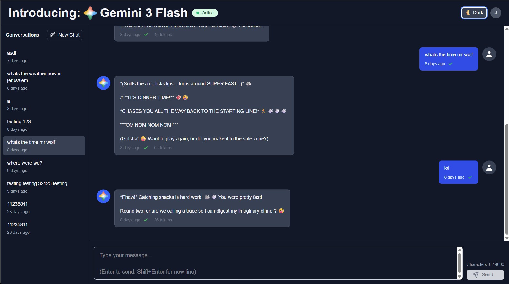

# AI Chat Application - Project Walkthrough



## Table of Contents

1. [Architecture Overview](#architecture-overview)
2. [Authentication Flow](#authentication-flow)
3. [Chat System](#chat-system)
4. [Security Features](#security-features)
5. [Performance & Reliability](#performance--reliability)
6. [Testing](#testing)
7. [Deployment](#deployment)
8. [Environment Variables](#environment-variables)
9. [See Also](#see-also)

## Architecture Overview

This is a full-stack Next.js application with the following architecture:

### Technology Stack

- **Frontend**: Next.js 16 (React 19), TailwindCSS, TypeScript, shadcn-ui
- **State Management**: Redux + TanStack Query (React Query)
- **Authentication**: Google Identity Services (primary) and Microsoft MSAL / Azure AD (secondary)
- **Backend**: Next.js API Routes
- **Data Storage**: Redis (sessions, chat data, rate limiting)
- **AI Integration**: Google Gemini — defaults to `gemini-flash-latest`, which always tracks Google's newest Flash model, so the app gets new model upgrades automatically without a code change

### Directory Structure

```plaintext
app/
├── api/
│   ├── chat/
│   │   ├── route.ts
│   │   └── stream/
│   │       └── route.ts
│   └── auth/
│       └── [...nextauth]/
│           └── route.ts
├── chat/
│   ├── page.tsx
│   └── components/
│       ├── ChatHeader.tsx
│       ├── ChatInput.tsx
│       ├── ChatErrorBoundary.tsx
│       ├── ChatSignInPrompt.tsx
│       └── MessageList.tsx
├── login/
│   └── page.tsx
├── layout.tsx
└── page.tsx
components/
├── ui/
│   ├── button.tsx
│   └── input.tsx
└── ThemeToggle.tsx
lib/
├── auth/
│   ├── msalConfig.ts
│   ├── SessionProvider.tsx
│   └── useAuth.ts
├── llm/
│   └── service.ts
├── redis/
│   ├── chat.ts
│   ├── client.ts
│   └── keys.ts
└── constants/
    ├── common.ts
    └── strings.ts
server/
└── middleware/
    ├── csrf.ts
    ├── rate-limit.ts
    └── session.ts
types/
└── models.ts
```

### High-Level Architecture

[High-Level Architecture](dev-resources/architecture/review/diagrams/overview/high_level_architecture.md)

## Authentication Flow

The app supports two sign-in providers side by side: **Google** (Google Identity Services / GIS) is the primary, more prominent option, and **Microsoft** (MSAL / Azure AD) is a fully functional secondary option. Exactly one provider is ever "active" per browser session — signing in with one deactivates the other so a stale cached session can never resurrect alongside a fresh one. See `docs/authentication.md` for the full design (bootstrap resolution, provider-switch semantics, renewal, and the server-side issuer dispatch).

### MSAL Integration

The application uses Microsoft Authentication Library (MSAL) for Azure AD authentication:

1. **User clicks "Sign in with Microsoft"**
   - `components/landing/LandingSignInButton.tsx` / `app/chat/components/ChatSignInPrompt.tsx` render the login UI
   - `lib/auth/useAuth.ts` provides authentication methods

2. **MSAL Popup Flow**
   - User authenticates via Microsoft popup
   - MSAL returns access token and user info
   - Token stored in sessionStorage (secure)

3. **Token Lifecycle**
   - Access tokens expire in ~1 hour
   - `lib/auth/useAuth.ts` monitors token expiry
   - Automatic silent refresh before expiration
   - Retry logic with exponential backoff

4. **Session Creation**
   - Server validates the MSAL access token via `server/middleware/session.ts` (`getSessionFromJwtFallback`, dispatched by issuer)
   - No cookie or Redis session is created: every request is authenticated statelessly from the `Authorization: Bearer` header, and the CSRF token is derived deterministically as `SHA-256(bearer token)` rather than stored server-side

### Google Sign-In Integration

The application uses Google Identity Services (GIS) for Google sign-in, rendered as the primary option:

1. **User clicks the Google button** rendered by `components/auth/GoogleSignInButton.tsx` (the sole call site of GIS's `renderButton`)
2. **GIS returns a signed ID token** (JWT) to the credential callback owned by `lib/auth/GoogleAuthProvider.tsx`
3. **The ID token is used directly as the bearer token** sent to the API — no separate access-token exchange is needed
4. **Server validates the ID token** via `server/middleware/google-auth.ts` (signature verified against Google's published JWKS, audience/issuer/email-verified checked)
5. **Session creation** follows the same JWT-fallback path as MSAL (`server/middleware/session.ts`), normalized to `userId = google:<sub>`

### Authentication Flow Diagram

[Authentication Flow](dev-resources/architecture/review/diagrams/user/authentication_flow.md)

## Chat System

### Data Flow

1. **User sends message**
   - `ChatInput` component captures input
   - `useStreamingResponse` hook posts to `/api/chat/stream`
   - The message renders immediately from in-memory live state, before the
     server confirms it

2. **Server processing**
   - CSRF validation (critical!)
   - Rate limiting check
   - Session verification
   - Message sanitization (XSS prevention)
   - Idempotency check (prevent duplicates)

3. **Database transaction**
   - User message saved to Redis
   - LLM called with timeout (30s)
   - AI response saved
   - Transaction committed or rolled back

4. **Response handling**
   - Success: Update cache with server response
   - Error: Rollback optimistic update
   - Retry with exponential backoff

### Streaming Responses (SSE)

For real-time AI responses:

1. Client connects to `/api/chat/stream`
2. Server streams tokens as they arrive
3. Client updates UI progressively
4. Heartbeat messages prevent timeout
5. Automatic reconnection on disconnect

### SSE Flow Diagram

[Real-time Chat Flow (SSE)](dev-resources/architecture/review/diagrams/chat/sse_flow.md)

### Key Features

- **Optimistic Updates**: Instant UI feedback
- **Idempotency**: Prevent duplicate messages (24h key TTL)
- **Token Validation**: Check context length before API call
- **Transaction Support**: Atomic operations with rollback
- **Message Reconciliation**: Temp ID → Server ID mapping
- **Status Indicators**: sending, sent, failed, read

## Security Features

### CSRF Protection

- Token generated per session
- Validated BEFORE rate limiting (prevent CSRF attacks)
- Token rotated on privilege escalation
- Middleware: `server/middleware/csrf.ts`

### Rate Limiting

- Per-user and per-IP rate limiting
- Sliding window counters in Redis
- Configurable limits per endpoint
- Middleware: `server/middleware/rate-limit.ts`

### Content Sanitization

- All user input sanitized via DOMPurify
- XSS prevention in message rendering
- `lib/sanitizer.ts`

## Performance & Reliability

### Redis Resilience

- **Circuit Breaker**: Prevents repeated calls to a failing service.
- **Connection Pooling**: Efficiently manages Redis connections.
- **Retry Logic**: Exponential backoff for transient errors.

### Frontend Performance

- **Code Splitting**: Automatic per-page code splitting.
- **Lazy Loading**: Components loaded on demand.
- **Stale-While-Revalidate**: TanStack Query caching.
- **Optimistic Updates**: Instant UI feedback.
- **Debounced Validation**: 300ms delay on input.

### Monitoring

- **Web Vitals**: `components/WebVitalsReporter.tsx` reports Core Web Vitals.
- **Logging**: `utils/logger.ts` provides structured logging.

## Testing

### Test Coverage

- **Unit Tests**: Jest and React Testing Library for components and utilities.
- **Integration Tests**: Jest and MSW for API and feature workflows.
- **E2E Tests**: Playwright for full user journeys.

### Running Tests

```bash
# Unit tests
pnpm test:unit

# Integration tests
pnpm test

# E2E tests
pnpm test:e2e
```

## Deployment

### Prerequisites

- Node.js 20+
- Redis instance (or Redis Cloud)
- Google Cloud OAuth 2.0 client (for Google sign-in)
- Azure AD application registration (for Microsoft sign-in)

### Google Cloud Console Setup

1. Create an OAuth 2.0 **Web application** client in the [Google Cloud Console](https://console.cloud.google.com/apis/credentials)
2. Configure it for **callback/One Tap mode** — Google Identity Services does not use redirect URIs; instead, register **Authorized JavaScript origins** for every environment. The values below are placeholders — replace `your-domain.com` (and the staging subdomain) with the actual domain(s) this app is deployed to; omit the staging entry entirely if no staging environment exists:
   - `http://localhost:3000` (dev)
   - `https://staging.your-domain.com` (staging — example only; replace with your real staging host, or remove this line if you don't have one)
   - `https://your-domain.com` (prod — replace with your real production domain)
3. Leave "Authorized redirect URIs" empty — GIS returns the credential directly to the page via a callback, not a redirect
4. Note the **Client ID** (no client secret is needed on the client — GIS ID tokens are verified server-side against Google's public JWKS)
5. Requested scopes are fixed to `openid email profile` — no additional consent scopes are requested

### Azure AD Setup

1. Register application in Azure Portal
2. Configure redirect URIs:
   - `http://localhost:3000` (dev)
   - `https://your-domain.com` (prod)
3. Enable ID tokens and access tokens
4. Note: Client ID, Tenant ID

### Environment Variables

Create `.env.local`:

```bash
# Google Identity Services (Sign in with Google) — primary sign-in option
NEXT_PUBLIC_GOOGLE_CLIENT_ID=your_google_oauth_client_id

# Azure AD / MSAL — secondary sign-in option
NEXT_PUBLIC_AZURE_AD_CLIENT_ID=your_client_id
NEXT_PUBLIC_AZURE_AD_TENANT_ID=your_tenant_id
NEXT_PUBLIC_REDIRECT_URI=http://localhost:3000
NEXT_PUBLIC_POST_LOGOUT_REDIRECT_URI=http://localhost:3000/login

# Redis
REDIS_URL=redis://localhost:6379

# NextAuth (for session secret)
NEXTAUTH_SECRET=generate_with_openssl_rand_base64_32
NEXTAUTH_URL=http://localhost:3000

# Google Gemini
GEMINI_API_KEY=your_gemini_api_key
GEMINI_MODEL=gemini-flash-latest  # optional, defaults to gemini-flash-latest
```

No client secret is committed or required for Google sign-in — `NEXT_PUBLIC_GOOGLE_CLIENT_ID` is a public identifier by design (same trust model as the Azure AD client ID above). If `NEXT_PUBLIC_GOOGLE_CLIENT_ID` is unset, the Google button simply doesn't render and Microsoft sign-in continues to work normally.

### Build & Run

```bash
# Install dependencies
pnpm install

# Development
pnpm dev

# Production build
pnpm build
pnpm start
```

### Deployment Platforms

- **Vercel (Recommended)**: The easiest way to deploy your Next.js app.
- **Docker**: A `Dockerfile` is provided for containerized deployments.

### Deployment Diagram

[Deployment Architecture](dev-resources/architecture/review/diagrams/deployment/deployment.md)

## Accessibility

The application has been audited for WCAG 2.1 Level AA compliance. See `ACCESSIBILITY_AUDIT.md` for the full report.

### Key Accessibility Features

- **Semantic HTML**: Proper use of ARIA roles, labels, and landmarks
- **Keyboard Navigation**: Full keyboard support with visible focus indicators
- **Screen Reader Support**: Live regions, status messages, and descriptive labels
- **Color Contrast**: All color combinations meet WCAG AA standards (4.5:1 minimum)
- **Focus Management**: Logical tab order and focus trap prevention
- **Error Handling**: Clear error messages with `role="alert"` and `aria-live`

## See Also

- **[Architecture Diagrams](dev-resources/architecture/review/diagrams)**: For a more detailed look at the application's architecture.
