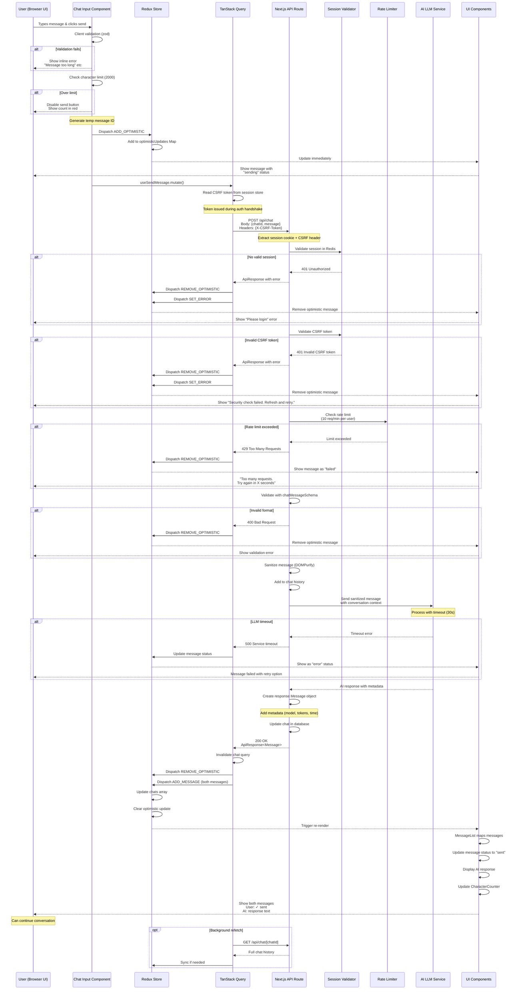

# Chat Interaction Flow Diagram - User to AI Communication

Based on the AI-Powered Chat Application architecture, this sequence diagram illustrates the complete flow when a user sends a message to the AI and receives a response in the UI.

## User Chat Interaction Sequence

## Key UI/UX Features Illustrated

### Optimistic Updates

- **Immediate feedback**: Message appears instantly with "sending" status
- **Temp ID reconciliation**: Client-generated ID replaced with server ID
- **Rollback on failure**: Message removed or marked as failed

### Visual Status Indicators

- **sending**: Loading spinner, grayed text
- **sent**: Checkmark icon, full opacity
- **error**: Red indicator, retry button
- **typing**: Three-dot animation for AI response

### Character Counter

- **Real-time updates**: Shows remaining characters
- **Color coding**: Green → Yellow → Red as limit approaches
- **Hard limit**: Send disabled at 2000 characters

### Error Recovery

- **Inline errors**: Validation errors appear below input
- **Toast notifications**: Rate limit errors as toasts
- **Retry mechanism**: Failed messages can be resent
- **Session expiry**: Graceful redirect to login

## State Management Flow

### Redux State Updates

1. **ADD_OPTIMISTIC**: Temporary message added to Map
2. **ADD_MESSAGE**: Permanent messages added to chats array
3. **REMOVE_OPTIMISTIC**: Cleanup after server response
4. **SET_ERROR**: Global error state for UI

### TanStack Query Cache

- **Optimistic update**: Immediate UI update
- **Background refetch**: Ensures data consistency
- **Query invalidation**: After successful mutation
- **Stale-while-revalidate**: Serves cached data during fetch

## Performance Optimizations

- **Debounced validation**: 300ms delay for real-time validation
- **Message batching**: Multiple rapid sends queued
- **Virtual scrolling**: For long chat histories
- **Memoized selectors**: Redux selectors prevent unnecessary renders
- **Lazy loading**: AI response streamed in chunks (future enhancement)

## Accessibility Features

- **Screen reader announcements**:
  - "Message sent successfully"
  - "AI is typing a response"
  - "New message received"
- **Keyboard shortcuts**:
  - Enter to send (Shift+Enter for newline)
  - Escape to cancel editing
- **Focus management**:
  - Focus returns to input after send
  - New messages don't steal focus
- **aria-live regions**: Dynamic updates announced

## Error Scenarios Handled

1. **Network failure**: Offline detection, retry queue
2. **Session timeout**: Automatic re-authentication prompt
3. **Rate limiting**: Clear countdown timer
4. **Validation errors**: Specific field-level messages
5. **LLM service down**: Fallback error message
6. **Message too long**: Truncation warning
7. **Concurrent edits**: Optimistic locking

## Security Measures

- **XSS prevention**: All messages sanitized with DOMPurify
- **CSRF tokens**: `X-CSRF-Token` header required and validated before rate limiting
- **Rate limiting**: Per-user limits enforced
- **Session validation**: Every request checks Redis
- **Input validation**: Zod schemas on client and server
- **UUID validation**: Prevents ID injection attacks

## Monitoring Points

- Message send success/failure rate
- Average response time from LLM
- Rate limit hit frequency
- Client-side validation vs server-side rejection ratio
- Optimistic update rollback frequency
- Character limit violations
