# Chat Interaction Flow Diagram - User to AI Communication

Based on the AI-Powered Chat Application architecture, this diagram maps the complete chat interaction flow with enhanced security, state management, and error handling.

## Chat Interaction Flow

```mermaid
graph TD
    Start([User opens chat interface]) --> LoadChat{Existing chat?}
    
    LoadChat -->|Yes| FetchHistory[Fetch chat history]
    LoadChat -->|No| CreateChat[Create new chat session]
    
    FetchHistory --> ValidateSession1{Session valid?}
    CreateChat --> ValidateSession2{Session valid?}
    
    ValidateSession1 -->|No| RedirectLogin1[Redirect to login]
    ValidateSession2 -->|No| RedirectLogin2[Redirect to login]
    
    ValidateSession1 -->|Yes| LoadMessages[Load from TanStack Query cache]
    ValidateSession2 -->|Yes| InitializeChat[Initialize empty chat]
    
    LoadMessages --> RenderChat[Render chat interface]
    InitializeChat --> RenderChat
    
    RenderChat --> UserInput[User types message]
    
    UserInput --> ValidateInput{Input valid?}
    
    ValidateInput -->|Too long| ShowError1[Show character limit error]
    ValidateInput -->|Empty| ShowError2[Show empty message error]
    ValidateInput -->|Valid| PrepareMessage[Generate client message ID]
    
    ShowError1 --> UserInput
    ShowError2 --> UserInput
    
    PrepareMessage --> CheckCSRF{CSRF token valid?}
    
    CheckCSRF -->|No| RefreshToken[Refresh CSRF token]
    CheckCSRF -->|Yes| OptimisticUpdate[Add to Redux optimistically]
    
    RefreshToken --> SessionCheck{Session still valid?}
    SessionCheck -->|No| RedirectLogin3[Redirect to login]
    SessionCheck -->|Yes| OptimisticUpdate
    
    OptimisticUpdate --> ShowSending[Display sending status]
    
    ShowSending --> CheckIdempotency{Message ID exists?}
    
    CheckIdempotency -->|Yes| ReturnExisting[Return existing response]
    CheckIdempotency -->|No| ValidateServer[Server-side validation]
    
    ReturnExisting --> UpdateUI[Update UI with response]
    
    ValidateServer --> RateCheck{Rate limit OK?}
    
    RateCheck -->|Exceeded| RateLimitError[Show rate limit error]
    RateCheck -->|OK| TokenCheck{MSAL token valid?}
    
    RateLimitError --> RollbackOptimistic[Remove optimistic update]
    RollbackOptimistic --> ShowRetry[Show retry after X seconds]
    ShowRetry --> UserInput
    
    TokenCheck -->|Expired| RefreshMSAL[Refresh MSAL token]
    TokenCheck -->|Valid| SanitizeInput[Sanitize with DOMPurify]
    
    RefreshMSAL --> TokenRefreshed{Refresh success?}
    TokenRefreshed -->|No| AuthError[Show auth error]
    TokenRefreshed -->|Yes| SanitizeInput
    
    AuthError --> RollbackOptimistic
    
    SanitizeInput --> SaveUserMsg[Save user message as pending]
    
    SaveUserMsg --> PrepareContext[Calculate context window]
    
    PrepareContext --> ContextCheck{Context too large?}
    
    ContextCheck -->|Yes| TruncateContext[Truncate or summarize old messages]
    ContextCheck -->|No| SendToLLM[Send to AI LLM service]
    
    TruncateContext --> SendToLLM
    
    SendToLLM --> ShowTyping[Show AI is typing indicator]
    
    ShowTyping --> StreamResponse{Use streaming?}
    
    StreamResponse -->|Yes| OpenSSE[Open SSE/WebSocket connection]
    StreamResponse -->|No| WaitResponse[Wait for full response]
    
    OpenSSE --> ReceiveChunk[Receive response chunk]
    ReceiveChunk --> UpdatePartial[Update UI progressively]
    UpdatePartial --> MoreChunks{More chunks?}
    MoreChunks -->|Yes| ReceiveChunk
    MoreChunks -->|No| CompleteStream[Complete streaming]
    
    WaitResponse --> Timeout{Response within 30s?}
    
    Timeout -->|No| HandleTimeout[Mark message failed]
    Timeout -->|Yes| ReceiveResponse[Receive AI response]
    
    HandleTimeout --> UpdateStatus1[Update status to error]
    UpdateStatus1 --> EnableRetry[Enable retry button]
    EnableRetry --> UserDecision{User retries?}
    
    UserDecision -->|Yes| PrepareMessage
    UserDecision -->|No| UserInput
    
    CompleteStream --> SaveResponse[Save AI response to DB]
    ReceiveResponse --> SaveResponse
    
    SaveResponse --> DBTransaction{Transaction success?}
    
    DBTransaction -->|Failed| PartialSave[Save with error status]
    DBTransaction -->|Success| UpdateRedux[Update Redux store]
    
    PartialSave --> LogError[Log to Sentry]
    LogError --> ShowWarning[Show data warning]
    ShowWarning --> UpdateRedux
    
    UpdateRedux --> RemoveOptimistic[Remove optimistic update]
    RemoveOptimistic --> AddFinalMessages[Add final messages to store]
    AddFinalMessages --> InvalidateQuery[Invalidate TanStack Query]
    InvalidateQuery --> UpdateStatus2[Update status to sent]
    UpdateStatus2 --> UpdateUI
    
    UpdateUI --> ScrollToBottom[Auto-scroll to latest]
    ScrollToBottom --> ResetInput[Clear input & reset counter]
    ResetInput --> UserInput
    
    style Start fill:#e1f5e1
    style UpdateUI fill:#e1f5e1
    style RedirectLogin1 fill:#ffe1e1
    style RedirectLogin2 fill:#ffe1e1
    style RedirectLogin3 fill:#ffe1e1
    style RateLimitError fill:#ffe1e1
    style AuthError fill:#ffe1e1
    style HandleTimeout fill:#ffe1e1
```

## Key Architecture Features Highlighted

### State Management

- **Redux Store**: Manages chat state with optimistic updates
- **TanStack Query**: Handles server state caching and synchronization
- **Optimistic UI**: Immediate feedback with rollback on failure
- **Message Reconciliation**: Client-generated IDs prevent duplicates

### Security Measures

- **CSRF Protection**: Token validation on every mutation
- **MSAL Token Management**: Automatic refresh before expiry
- **Input Sanitization**: DOMPurify for XSS prevention
- **Rate Limiting**: Per-user limits with sliding window
- **Idempotency**: Prevents duplicate message processing

### Performance Optimizations

- **Streaming Responses**: SSE/WebSocket for real-time updates
- **Context Management**: Smart truncation for token limits
- **Query Caching**: Efficient data fetching with TanStack Query
- **Debounced Validation**: 300ms delay for input validation
- **Progressive Updates**: Chunk-by-chunk UI updates

### Error Handling

- **Transaction Pattern**: Two-phase commit for data consistency
- **Graceful Degradation**: Partial saves on DB failures
- **Timeout Management**: 30-second limit with retry options
- **Error Tracking**: Sentry integration for monitoring
- **User Feedback**: Clear error messages with recovery actions

## Critical Flow Improvements

### Database Transactions

- Begin transaction before LLM call
- Save user message with "pending" status
- Update with response or mark as "failed"
- Commit or rollback based on success

### Token Management

- Check MSAL token expiry before LLM calls
- Automatic refresh with retry logic
- Fallback to re-authentication if refresh fails

### Context Window Management

- Calculate token count before sending
- Implement truncation strategy for long conversations
- Optional summarization for older messages

### Real-time Communication

- WebSocket/SSE for streaming responses
- Progressive UI updates as tokens arrive
- Connection management with auto-reconnect

## Monitoring Points

- Message send success/failure rates
- Average LLM response times
- Token refresh frequency
- Rate limit violations per user
- Context truncation frequency
- Streaming vs. blocking request ratio
- Database transaction failures
- Optimistic update rollback rate

## Accessibility Considerations

- Screen reader announcements for status changes
- Keyboard navigation support (Enter to send)
- Focus management after message send
- aria-live regions for dynamic updates
- High contrast mode support for status indicators

## Error Recovery Strategies

1. **Network Failures**: Offline queue with retry
2. **Token Expiry**: Automatic refresh flow
3. **Rate Limits**: Clear countdown with alternatives
4. **LLM Timeout**: Retry with exponential backoff
5. **Database Errors**: Partial save with warning
6. **Session Loss**: Graceful re-authentication
7. **Context Overflow**: Smart truncation/summarization
