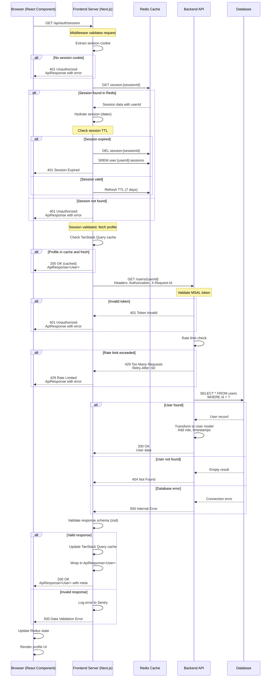

# Data Flow Diagram - Fetch User Profile

Based on the AI-Powered Chat Application architecture, this sequence diagram illustrates the complete data flow for fetching a user profile, including authentication, caching, and error handling.

## Fetch User Profile Sequence

## Key Architecture Features Illustrated

### Authentication & Session Management

- **Cookie-based session**: Secure HTTP-only cookies contain session ID
- **Redis session storage**: Server-side session with 7-day TTL
- **Session hydration**: Date strings converted to Date objects
- **Per-user session indexing**: Efficient session lookups via Redis Sets
- **MSAL token validation**: Backend validates Microsoft identity tokens

### Caching Strategy

- **TanStack Query cache**: Client-side caching with stale-while-revalidate
- **Redis session cache**: Server-side session persistence
- **Cache-Control headers**: `private, max-age=0` for session endpoint

### Error Handling

- **Structured errors**: ApiResponse wrapper with error codes
- **Status codes**: Proper HTTP status codes (401, 404, 429, 500)
- **Rate limiting**: 429 response with Retry-After header
- **Error tracking**: Sentry integration for monitoring

### Security Features

- **Session validation**: Every request validates session existence and TTL
- **Token validation**: MSAL tokens verified on backend
- **Rate limiting**: Per-user rate limits enforced
- **Request tracking**: X-Request-Id header for correlation

### Data Transformation

- **Schema validation**: Zod schemas validate all responses
- **Type safety**: TypeScript interfaces for User, Session, ApiResponse
- **Data enrichment**: Backend adds computed fields (role, timestamps)

## Error Recovery Flows

### Session Expired

1. Redis returns expired session
2. Frontend cleans up session data
3. Browser redirected to login

### Rate Limited

1. Backend returns 429 with Retry-After
2. Frontend caches retry window
3. UI shows user-friendly message with countdown

### Network Failure

1. TanStack Query retries with exponential backoff
2. Fallback to cached data if available
3. Error boundary catches unrecoverable errors

## Performance Optimizations

- **Query deduplication**: TanStack Query prevents duplicate requests
- **Background refetching**: Stale data served while fetching fresh
- **Efficient Redis operations**: Using SMEMBERS instead of KEYS
- **Response compression**: Gzip/Brotli for API responses
- **Selective field fetching**: Only required user fields queried

## Monitoring Points

- Session validation success/failure rates
- Cache hit/miss ratios
- API response times (P50, P95, P99)
- Rate limit violations per user
- Database query performance
