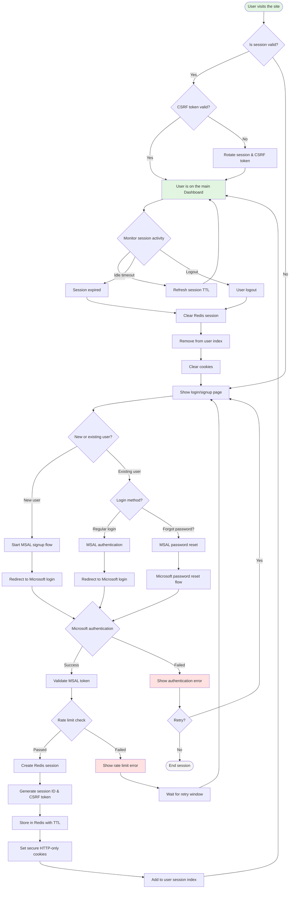

# User Authentication Flow Diagram

Based on the AI-Powered Chat Application architecture, this diagram maps the complete user authentication flow using MSAL integration with Redis session management and CSRF protection.

## Authentication Flow

## Key Security Features Highlighted

### Session Management

- **Redis Storage**: Server-side session storage with per-user indexing
- **Session Rotation**: Automatic rotation on privilege changes
- **TTL Management**: 7-day expiry with activity-based refresh

### CSRF Protection

- **Token Generation**: Secure random token per session
- **Double-Submit Pattern**: Token validation on state-changing requests
- **Automatic Rotation**: New tokens on session rotation

### Rate Limiting

- **Per-User Limits**: Sliding window counters in Redis
- **IP-Based Fallback**: Additional protection for unauthenticated requests
- **Configurable Thresholds**: 10 requests/minute for chat endpoints

### Cookie Security

- **HttpOnly**: Prevents JavaScript access
- **Secure**: HTTPS-only transmission
- **SameSite**: CSRF mitigation
- **Domain Scoping**: Restricted to application domain

## Error Recovery Paths

1. **Authentication Failure**
   - Clear error messaging
   - Retry option with rate limiting
   - Fallback to password reset

2. **Session Expiry**
   - Graceful degradation
   - Automatic cleanup
   - Re-authentication prompt

3. **Rate Limit Exceeded**
   - Informative error with retry window
   - Exponential backoff guidance
   - Alternative action suggestions

## Integration Points

- **MSAL**: Microsoft identity platform integration
- **Redis**: Session and rate limit storage
- **Next.js Middleware**: Request interception and validation
- **API Routes**: Protected endpoints with session validation

## Monitoring Touchpoints

- Session creation/deletion events
- Authentication success/failure rates
- Rate limit violations
- CSRF token validation failures
- Session activity patterns
