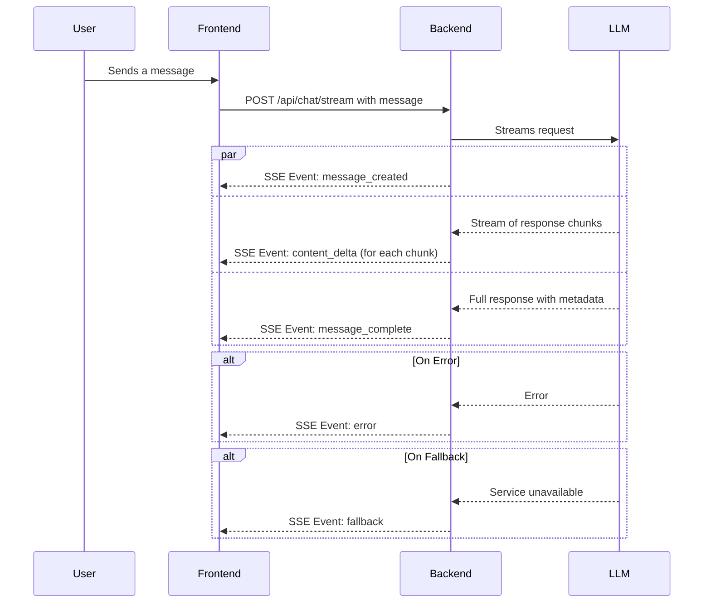

# Real-time Chat Flow (SSE)

```mermaid
sequenceDiagram
    participant User
    participant Frontend
    participant Backend
    participant LLM

    User->>Frontend: Sends a message
    Frontend->>Backend: POST /api/chat/stream with message
    Backend->>LLM: Streams request
    
    par
        Backend-->>Frontend: SSE Event: message_created
    and
        LLM-->>Backend: Stream of response chunks
        Backend-->>Frontend: SSE Event: content_delta (for each chunk)
    and
        LLM-->>Backend: Full response with metadata
        Backend-->>Frontend: SSE Event: message_complete
    end

    alt On Error
        LLM-->>Backend: Error
        Backend-->>Frontend: SSE Event: error
    end

    alt On Fallback
        LLM-->>Backend: Service unavailable
        Backend-->>Frontend: SSE Event: fallback
    end
```
