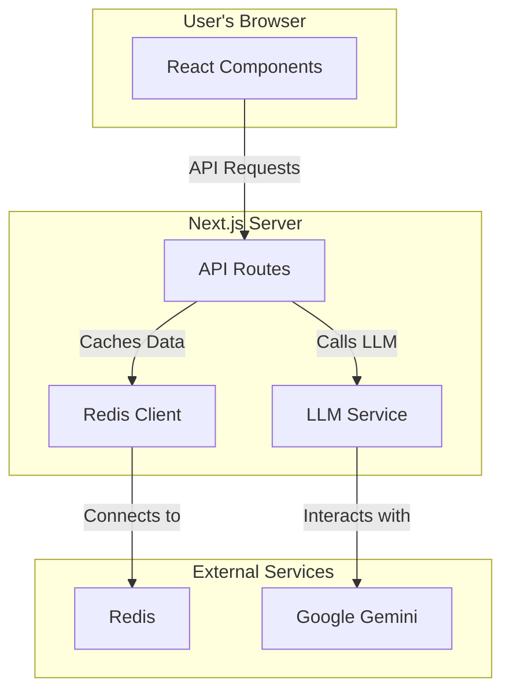

# Data Flow

```mermaid
graph TD
    subgraph "User's Browser"
        A[React Components]
    end

    subgraph "Next.js Server"
        B[API Routes]
        C[LLM Service]
        D[Redis Client]
    end

    subgraph "External Services"
        E[Redis]
        F[Google Gemini]
    end

    A --"API Requests"--> B
    B --"Calls LLM"--> C
    C --"Interacts with"--> F
    B --"Caches Data"--> D
    D --"Connects to"--> E
```
