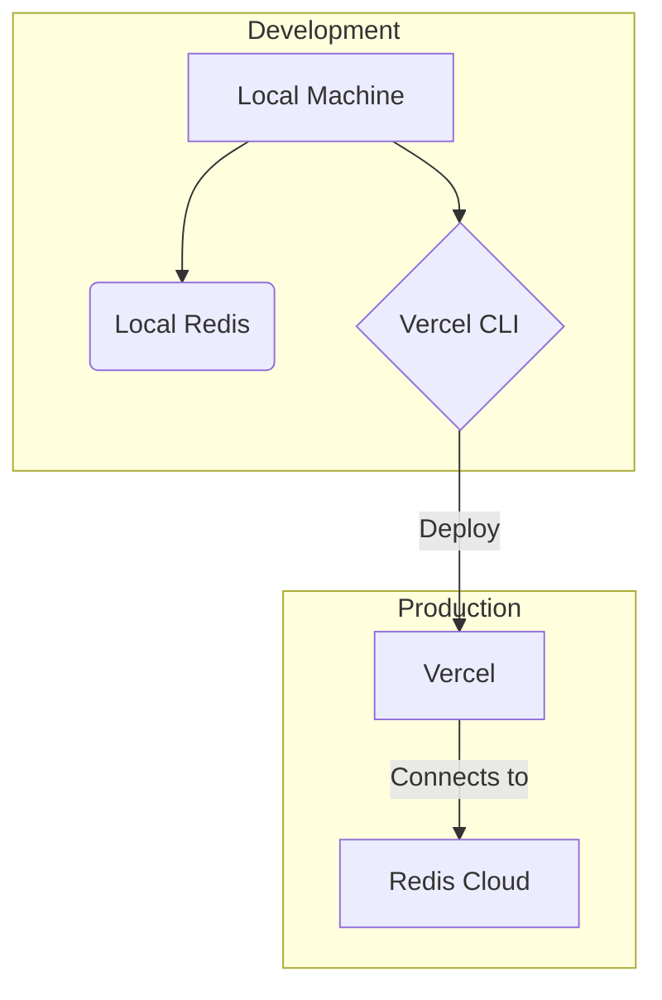

# Deployment Architecture

```mermaid
graph TD
    subgraph "Development"
        A[Local Machine] --> B(Local Redis)
        A --> C{Vercel CLI}
    end

    subgraph "Production"
        D[Vercel]
        E[Redis Cloud]
    end

    C --"Deploy"--> D
    D --"Connects to"--> E

```
