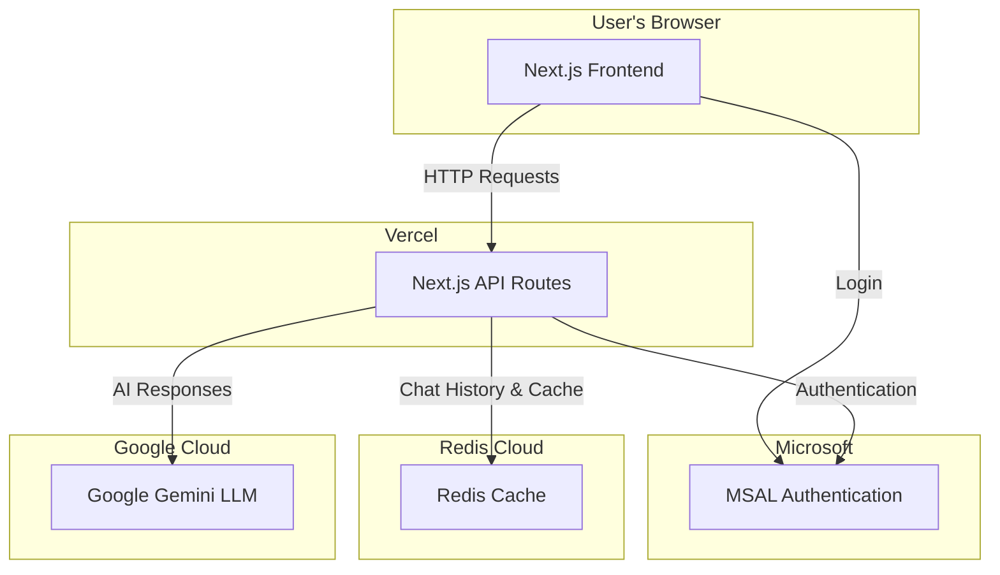

# High-Level Architecture

```mermaid
graph TD
    subgraph "User's Browser"
        A[Next.js Frontend]
    end

    subgraph "Vercel"
        B[Next.js API Routes]
    end

    subgraph "Microsoft"
        C[MSAL Authentication]
    end

    subgraph "Redis Cloud"
        D[Redis Cache]
    end

    subgraph "Google Cloud"
        E[Google Gemini LLM]
    end

    A --"HTTP Requests"--> B
    A --"Login"--> C
    B --"Authentication"--> C
    B --"Chat History & Cache"--> D
    B --"AI Responses"--> E
```
