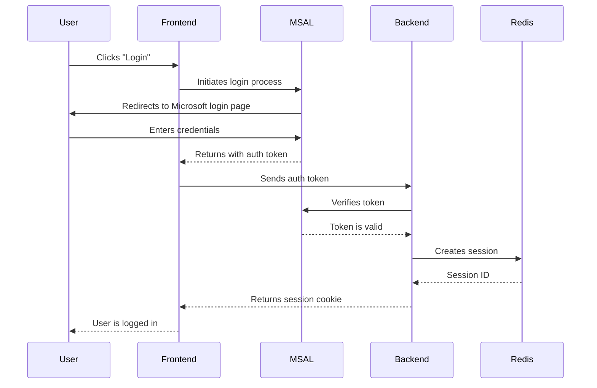

# Authentication Flow

```mermaid
sequenceDiagram
    participant User
    participant Frontend
    participant MSAL
    participant Backend
    participant Redis

    User->>Frontend: Clicks "Login"
    Frontend->>MSAL: Initiates login process
    MSAL->>User: Redirects to Microsoft login page
    User->>MSAL: Enters credentials
    MSAL-->>Frontend: Returns with auth token
    Frontend->>Backend: Sends auth token
    Backend->>MSAL: Verifies token
    MSAL-->>Backend: Token is valid
    Backend->>Redis: Creates session
    Redis-->>Backend: Session ID
    Backend-->>Frontend: Returns session cookie
    Frontend-->>User: User is logged in
```
